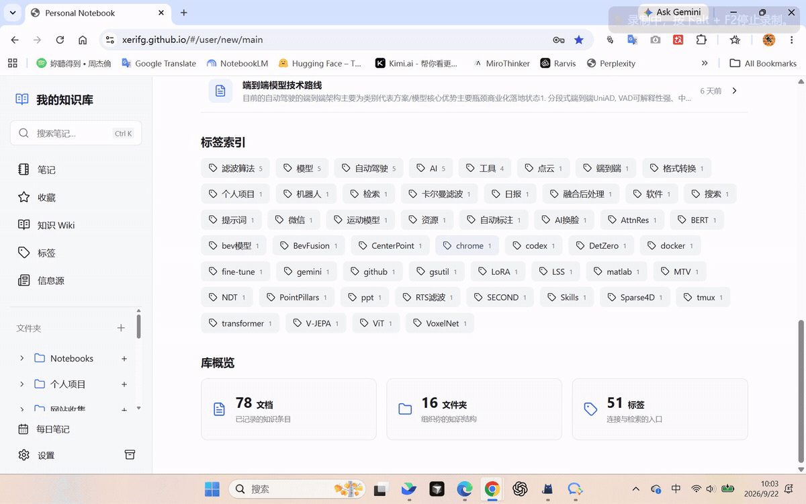

# Personal Notebook

一个部署在 GitHub Pages 上的个人知识库和笔记本，集成富文本笔记、白板、收藏、信息源、AI 问答和知识 Wiki。前端直接运行在浏览器中，已发布笔记与附件保存在 `notebooks/`；本地 Python 服务负责预览和附件缓存，Cloudflare 后端负责账号登录、GitHub 发布和云端知识服务。

[在线访问](https://xerifg.github.io/) · [云端部署说明](cloud/README.md) · [演示 GIF](assets/demo.gif)



## 当前功能

- GitHub Pages 静态访问，入口为 `index.html`。
- Tiptap/ProseMirror 富文本编辑器，支持标题、列表、引用、代码块、表格、任务列表、链接、高亮、LaTeX 公式、Mermaid 图表、图片、视频和文件附件；支持图片尺寸调整与预览。
- 正文内嵌白板：文本、图片、笔记引用、连线与分组，支持拖动、缩放、平移、撤销和重做，随笔记保存与发布。
- 统一左侧知识库、中央多标签笔记、右侧“大纲 / 关联 / AI 问答”；手机上按需展开目录和辅助栏。
- 知识库首页汇总知识领域、常用标签和库概览；标签浏览器支持搜索、排序、分组筛选和打开相关笔记。
- 收藏：笔记顶部星标收藏，独立页面搜索、按标签筛选、预览正文、手动排序或按最近更新排序；支持批量取消和撤销，并可发布同步收藏清单。
- 信息源：集中管理网站名称、地址、简介和分类，支持搜索、置顶、拖动排序、删除撤销和发布同步。
- 默认恢复上次位置、打开的标签页和阅读进度；点击左上角“我的知识库”进入概览，也可在设置中选择每次从概览启动。已有明确启动偏好保持不变。
- `Ctrl/Cmd + K` 搜索标题、别名、标签和正文，显示命中摘要；支持 `tag:标签`、`path:目录`、引号短语和 `-排除词`。
- 编辑正文输入 `[[` 选择内部引用，使用稳定 ID 关联笔记；阅读时显示最新标题和悬停摘要，右栏显示双向链接、引用上下文与一跳关系图。
- 论文、实验、概念、项目模板；类型、状态、来源和别名随笔记发布。左下角“每日笔记”打开或创建当天记录。
- “对照阅读”同时查看另一篇只读笔记；历史版本保留最近 20 个本机快照，恢复前自动保留当前版本。
- 左下角“备份与导出”下载完整 JSON 备份，或带附件的 Markdown ZIP；导入先审阅再合并为本地草稿，备份中没有的笔记会保留。
- 浏览器本地草稿自动保存，界面显示保存状态，保存失败时可重试；跨浏览器迁移或清理浏览器数据前需导出备份。
- 发布保持选择性与 GitHub-backed：审阅后只提交勾选的文档、目录、标签、收藏和信息源变更，未选改动继续保留为本地草稿。
- 附件先缓存在本地或浏览器中，发布后上传到 `notebooks/assets/{noteId}/` 并替换为仓库相对路径。
- 发布前验证自定义账号会话，由 Cloudflare 后端保管 GitHub Token，并处理文档路径去重、删除文档同步和 GitHub 写入冲突重试。
- 云端 AI 问答：基于已发布笔记检索，支持范围筛选、多轮追问、深入比较、流式回答和原文引用；AI 关联建议由用户确认后加入本地草稿。
- 知识 Wiki：从已发布笔记生成带证据的条目与链接图谱，支持搜索、一层/两层关系探索、人工编辑、版本恢复和备份导出。云端能力需单独部署，详见 [部署说明](cloud/README.md)。

## 实现路线

当前实现以纯静态前端为主：

1. 页面由 `index.html` 加载 `static/app.css` 和 `static/app.js`。
2. `static/app.js` 负责 React UI、Tiptap 编辑器、文档库状态、发布流程和 GitHub Contents API 调用。
3. `library-ui*` 提供首页、标签与设置，`knowledge-*` 负责工作区、链接、搜索、属性、历史与导出；`whiteboard-*`、`favorites-*`、`sources-*` 分别提供白板、收藏和信息源。
4. `server.py` 是本地辅助服务，提供静态文件服务和本地附件缓存接口。
5. 已发布内容存放在 `notebooks/` 下，GitHub Pages 直接读取这些 JSON 和资源文件。
6. `cloud/` 中的 Worker 提供登录、发布、问答和 Wiki API；GitHub Actions 构建知识索引，D1 与 Vectorize 保存云端数据，`static/cloud-config.json` 提供公开服务地址。

## 目录结构

```text
index.html              # GitHub Pages 入口
static/
  app.js                # 前端应用、编辑器、发布逻辑
  app.css               # 页面样式
  library-ui.mjs        # 首页、标签与设置视图
  workspace.css        # 三栏工作区与响应式样式
  knowledge-model.mjs  # 链接、检索、模板、备份合并模型
  knowledge-ui.mjs     # 工作区、属性与关系面板
  knowledge-storage.mjs # 历史快照、备份恢复、Markdown 导出
  library-ui-model.mjs  # 启动偏好、知识库概览与标签浏览模型
  whiteboard-*.mjs       # 白板模型与界面
  note-whiteboard.mjs    # 正文白板节点
  favorites-*.mjs        # 收藏模型与界面
  sources-*.mjs          # 信息源模型与界面
  cloud-*.mjs           # 云端客户端、问答、Wiki 与图谱
  cloud-config.json     # 公开云端服务地址
notebooks/
  index.json            # 已发布文档索引
  favorites.json        # 已发布收藏清单
  docs/                 # 已发布文档 JSON
  assets/               # 已发布附件资源
  knowledge/wiki.json   # 自动生成的 Wiki 快照
cloud/                  # Worker、数据库结构、知识构建脚本与部署说明
assets/demo.gif         # README 演示
tests/
  *.test.mjs             # 数据模型、交互、编辑器、发布与 shell 回归测试
server.py               # 本地辅助服务
```

## 在线使用

访问：

```text
https://xerifg.github.io/
```

如果浏览器缓存了早期页面，可以强制刷新，或访问：

```text
https://xerifg.github.io/?v=notebook
```

## GitHub Pages 配置

仓库 `Settings -> Pages` 保持以下配置：

```text
Source: Deploy from a branch
Branch: main
Folder: / (root)
```

提交并推送到 `main` 后，GitHub Pages 会从仓库根目录发布页面。

## 编辑和发布

1. 打开笔记本首页。
2. 点击编辑入口进入编辑模式。
3. 按 [云端部署说明](cloud/README.md) 配置自定义账号；首次编辑或发布时登录笔记系统。GitHub Token 由后端保管，浏览器不再填写。
4. 内容会先保存到浏览器本地草稿。
5. 点击发布后，应用会先对比本地草稿与 GitHub 已发表内容，并列出新增、修改、删除以及目录和标签变更。
6. 审阅弹窗默认选中所有检测到的变更；可以取消选择不希望发表的项目，包括独立的收藏和信息源清单。未选内容会继续保留为本地草稿。
7. 选中文档时，必要的 `notebooks/index.json`、目录和标签信息会自动一并更新，保证线上页面能够正确显示。

发布后的核心文件：

```text
notebooks/index.json
notebooks/favorites.json
notebooks/docs/*.json
notebooks/assets/{noteId}/
```

## 常用操作

| 场景 | 使用方式 |
|---|---|
| 查找与阅读 | `Ctrl/Cmd + K` 搜索笔记；左侧文档树或标签页浏览，右侧大纲定位章节，多标签切换或使用“对照阅读”。 |
| 新建与记录 | 点击“新建笔记”并选择模板，或点击左下角“每日笔记”；编辑时输入 `[[` 插入内部引用。 |
| 插入白板 | 编辑正文时从插入菜单选择“白板”，或输入 `/白板`；展开画布添加文本、图片、笔记引用与连线，内容自动更新到正文。 |
| 收藏笔记 | 点击笔记顶部星标，在左侧“收藏”中预览、筛选和管理；点击“发布同步”进入变更审阅。 |
| 管理信息源 | 左侧“信息源” → “添加网站”；登录后填写名称、网址、简介与分类，调整顺序后发布同步。 |
| AI 问答 | 配置云端服务并登录，在右侧“AI 问答”选择检索范围后提问，点击引用核对原文；新发布内容需等待知识同步完成。 |
| 浏览 Wiki | 左侧“知识 Wiki”查看条目或知识图谱；可编辑人工稿、对比生成稿、查看历史和导出备份。人工稿保存在云端 D1。 |
| 备份与恢复 | 左下角“备份与导出”下载 JSON 或带附件的 Markdown ZIP；导入备份先审阅，再合并为本地草稿。 |

公开阅读无需登录；编辑、发布和云端问答/Wiki 使用自定义拥有者账号。登录不会自动同步未发布草稿。笔记历史与阅读进度保存在当前浏览器，Wiki 人工版本则保存在云端。

## 附件处理

编辑器支持三类附件：

- 图片：插入为图片预览。
- 视频：插入为播放器。
- 文件附件：插入为下载卡片。

本地服务运行时，附件会先缓存到：

```text
.notebook-cache/assets/
```

发布后，附件会上传到：

```text
notebooks/assets/{noteId}/
```

文档中的本地临时地址会替换为仓库内相对路径，因此线上访问时资源来自 GitHub Pages。

未启动本地辅助服务时，草稿附件保存在浏览器中。云端发布单个笔记文件或附件上限为 **5 MB**，超过上限需先压缩。

## 本地运行

需要 Python 3 和现代浏览器。前端无需 npm 安装或构建，但通过 CDN 加载 React、Tiptap 等依赖，首次访问需要联网。在仓库根目录启动本地服务：

```bash
python server.py
```

默认地址：

```text
http://127.0.0.1:8000/
```

请通过上述 HTTP 地址访问；直接双击 `index.html` 的 `file://` 方式可能受浏览器模块加载和资源请求限制。本地服务不替代云端账号、发布或 AI 服务。

## 本地服务配置

本地服务默认监听 `8000` 端口。如需修改，可设置环境变量：

```text
PORT=8000
```

编辑草稿仍在浏览器本地保存；发布经 Cloudflare 后端调用 GitHub Contents API，不经过 `server.py`。登录使用自定义账号，详情见 [云端配置](cloud/README.md)。本地地址测试云端接口时须将 Worker 的 `FRONTEND_ORIGIN` 设置为对应的本地来源；正式使用时改回线上站点。

## 测试

需要安装 Node.js。运行前端回归测试（PowerShell）：

```powershell
Get-ChildItem tests\*.test.mjs | ForEach-Object { node $_.FullName }
```

检查前端脚本语法：

```bash
node --check static/app.js
```

云端测试与离线构建验证见 [cloud/README.md](cloud/README.md#开发验证)；`tests/workspace-*.html` 提供浏览器交互验收页面。

## 发布

工作区升级的验收记录见 [design-qa.md](design-qa.md)。历史版本和阅读进度仅存于当前浏览器；定期下载 JSON 备份可在其他浏览器恢复。Markdown ZIP 同时包含完整恢复 JSON，外部网站媒体保留原地址。

“AI 关联建议”需要前端与更新后的 Cloudflare Worker 一起部署；服务端仅使用已发布笔记构建检索上下文，用户确认后才把引用添加为本地修改。

```bash
git add .
git commit -m "update notebook"
git push origin main
```

部署完成后访问：

```text
https://xerifg.github.io/
```

云端 AI 问答、知识 Wiki 和图谱的部署与验收说明见 [cloud/README.md](cloud/README.md)。无需购买服务器；模型 API 可单独付费。

## License

MIT
